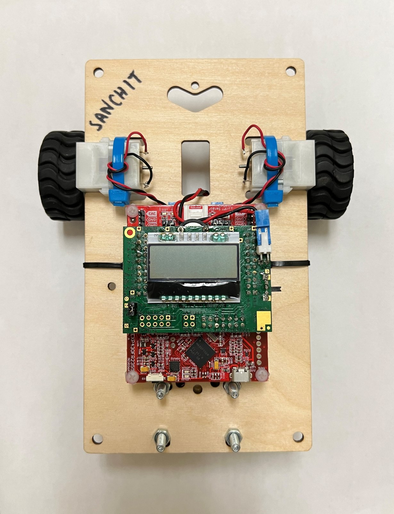
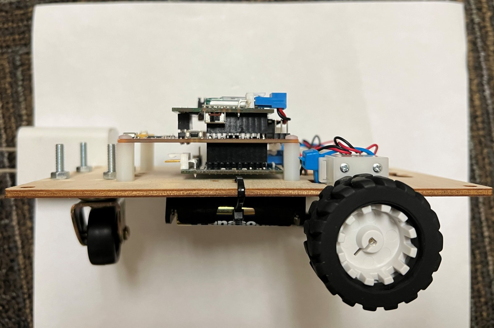
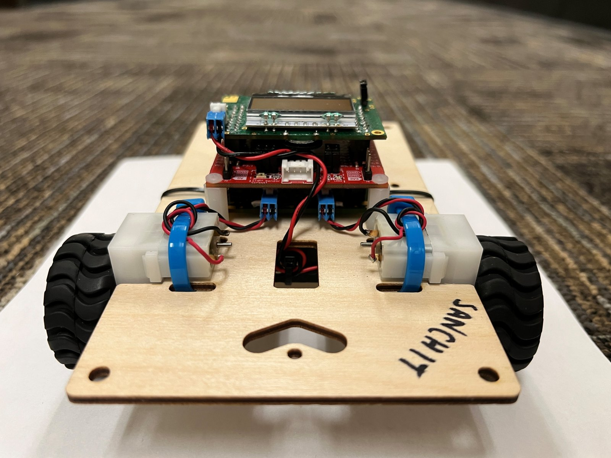

# Wi-Fi Controlled Line-Following Car (MSP430FR2355)

Embedded C firmware for a battery-powered, three-wheeled robot car, built for **ECE 306: Introduction to Embedded Systems** at NC State University (Fall 2024). You can drive the car remotely over Wi-Fi, or it can find and follow a black-tape line on its own using infrared sensors.

  
  
  

## Features

- **Wi-Fi remote control:** the car connects to a network through an ESP32 module and takes drive commands from a phone or PC.
- **Autonomous line following:** infrared sensors detect black tape, and the car finds the line and follows it.
- **On-device calibration:** line detection can be tuned to the floor surface using the onboard buttons and LCD.
- **Motor control:** each wheel has its own PWM speed and direction control.
- **Status display:** a 4-line LCD shows the network connection, sensor readings and the car's current mode.

## Hardware

- TI MSP-EXP430FR2355 LaunchPad
- Control board with an LCD and a thumbwheel
- H-bridge board driving two DC gearmotors
- Infrared emitter and two infrared detectors
- ESP32 Wi-Fi module
- 6 V battery pack

## Skills

Bare-metal C, interrupt-driven design, timers and PWM, ADC sampling, UART and SPI peripherals, state machines, and hardware bring-up and debugging.

## Tools

Code Composer Studio and the TI MSP430 compiler.

## Author

Sanchit Varshney
